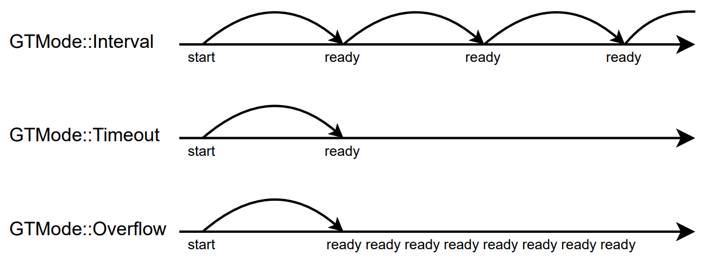

[](https://github.com/GyverLibs/GTimer/releases/latest/download/GTimer.zip)
[](https://registry.platformio.org/libraries/gyverlibs/GTimer)
[](https://alexgyver.ru/)
[](https://alexgyver.ru/support_alex/)
[](https://github-com.translate.goog/GyverLibs/GTimer?_x_tr_sl=ru&_x_tr_tl=en)  

[](https://t.me/GyverLibs)

# GTimer
Лёгкий и универсальный программный таймер
- Работает с `millis`, `micros` и любыми другими функциями аптайма типа `unsigned long uptime()`
- 3 режима работы: интервальный таймер, тайм-аут, переполнение
- 3 варианта памяти: 8, 16 и 32 бит периоды
- Возможность приостановки и продолжения счёта
- Два варианта фазы интервалов
- Лёгкая реализация - две переменных под таймер + 1 байт настроек
- Коллбэк и виртуальная функция срабатывания для наследования

### Совместимость
Все платформы

## Содержание
- [Использование](#usage)
- [Версии](#versions)
- [Установка](#install)
- [Баги и обратная связь](#feedback)

<a id="usage"></a>

## Использование
> [!NOTE]
> Таймер корректно переходит через "переполнение" функции аптайма (millis, micros)

### Режим работы
- `GTMode::Interval` - таймер перезапускается после срабатывания
- `GTMode::Timeout` - таймер останавливается после срабатывания
- `GTMode::Overflow` - таймер срабатывает после срабатывания



### Режим фазы
В режиме `keepPhase` срабатывание интервала кратно периоду даже при задержках в программе:


### Инициализация
Библиотека содержит 6 вариантов таймера:
- `GTimer` - 32 бит периоды (до 4 294 967 295)
- `GTimer16` - 16 бит периоды (до 65 535)
- `GTimer8` - 8 бит периоды (до 255)
- `GTimerCb`, `GTimerCb16`, `GTimerCb8` - то же самое, но с коллбэком

```cpp
GTimerX<uptime>(uint32_t time, bool start = false, GTMode mode = GTMode::Interval, bool keepPhase = false);
```

- `uptime` - функция аптайма (`millis`, `micros`, своя функция типа `unsigned long uptime(void)`)
- `time` - время в единицах таймера
- `start` - запустить сразу
- `mode` - режим работы
- `keepPhase` - режим фазы интервалов

### Описание классов
#### GTimerX

```cpp
// держать фазу в режиме Interval (умолч. false)
void keepPhase(bool keep);

// держать фазу в режиме Interval
bool getPhase();

// установить время в единицах таймера
void setTime(uint32_t time);

// установить время (для мс)
void setTime(uint32_t ms, uint32_t sec, uint16_t min = 0, uint16_t hour = 0, uint16_t day = 0);

// получить время в единицах таймера
T getTime();

// установить режим: GTMode::Interval, GTMode::Timeout, GTMode::Overflow
void setMode(GTMode mode);

// получить режим: GTMode::Interval, GTMode::Timeout, GTMode::Overflow
GTMode getMode();

// запустить с указанием времени (для мс)
void start(uint32_t ms, uint32_t sec, uint16_t min = 0, uint16_t hour = 0, uint16_t day = 0);

// запустить с указанием времени и режима
void start(uint32_t time, GTMode mode);

// запустить с указанием времени
void start(uint32_t time);

// запустить/перезапустить
void start();

// приостановить
void pause();

// продолжить
void resume();

// остановить
void stop();

// вызвать срабатывание
void force();

// таймер запущен
bool running();

// осталось времени в единицах таймера
T getLeft();

// осталось времени в 8 бит (0.. 255)
uint8_t getLeft8();

// осталось времени в 16 бит (0.. 65 535)
uint16_t getLeft16();

// тикер, вызывать в loop. Вернёт true при срабатывании
bool tick();

// вызов tick
operator bool();
```

#### GTimerCbX

```cpp
// подключить обработчик таймера
void attach(TimerCallback cb);

// отключить обработчик таймера
void detach();

// запустить в режиме таймаута
void startTimeout(uint32_t time, TimerCallback cb);

// запустить в режиме интервала
void startInterval(uint32_t time, TimerCallback cb);

// запустить в режиме переполнения
void startOverflow(uint32_t time, TimerCallback cb);

// вызывается при срабатывании
virtual void onReady();
```

- `TimerCallback` - функция вида `void f()`
- `void* thisGTimer` - указатель на текущий таймер внутри обработчика

## Примеры
### Обычный
```cpp
#include <Arduino.h>
#include <GTimer.h>

GTimer<millis> tmr1;

void setup() {
    Serial.begin(115200);

    tmr1.setMode(GTMode::Timeout);
    tmr1.setTime(2000);
    tmr1.start();
}

void loop() {
    if (tmr1) Serial.println("timeout");

    static GTimer<millis> tmr2(500, true);
    if (tmr2) Serial.println("interval");
}
```

### Обработчик
```cpp
#include <Arduino.h>
#include <GTimer.h>

GTimerCb<millis> tmr1, tmr2;

void onTimer() {
    Serial.println("ready 2");
}

void setup() {
    Serial.begin(115200);

    // лямбда
    tmr1.startInterval(500, []() {
        Serial.println("ready 1");

        // обращение к текущему таймеру
        // static_cast<GTimerCb<millis>*>(thisGTimer)->stop();
    });

    // внешний
    tmr2.startInterval(1000, onTimer);
}

void loop() {
    tmr1.tick();
    tmr2.tick();
}
```

### Виртуальный
```cpp
#include <Arduino.h>
#include <GTimer.h>

class TestTimer : public GTimerCb<millis> {
   public:
    using GTimerCb<millis>::GTimerCb;

    void onReady() {
        Serial.println("ready");
    }
};

TestTimer tmr(500, true);

void setup() {
    Serial.begin(115200);
}

void loop() {
    tmr.tick();
}
```

### Макрос
```cpp
#include <Arduino.h>
#include <GTimer.h>

void setup() {
    Serial.begin(115200);
}

void loop() {
  EVERY_T(500, millis) Serial.println("500 ms!");
  
  EVERY_T(100000, micros) {
    Serial.println("100000 us!");
  }
}
```

<a id="versions"></a>

## Версии
- v1.0
- v1.0.1 - добавлен макрос EVERY_T

<a id="install"></a>
## Установка
- Библиотеку можно найти по названию **GTimer** и установить через менеджер библиотек в:
    - Arduino IDE
    - Arduino IDE v2
    - PlatformIO
- [Скачать библиотеку](https://github.com/GyverLibs/GTimer/archive/refs/heads/main.zip) .zip архивом для ручной установки:
    - Распаковать и положить в *C:\Program Files (x86)\Arduino\libraries* (Windows x64)
    - Распаковать и положить в *C:\Program Files\Arduino\libraries* (Windows x32)
    - Распаковать и положить в *Документы/Arduino/libraries/*
    - (Arduino IDE) автоматическая установка из .zip: *Скетч/Подключить библиотеку/Добавить .ZIP библиотеку…* и указать скачанный архив
- Читай более подробную инструкцию по установке библиотек [здесь](https://alexgyver.ru/arduino-first/#%D0%A3%D1%81%D1%82%D0%B0%D0%BD%D0%BE%D0%B2%D0%BA%D0%B0_%D0%B1%D0%B8%D0%B1%D0%BB%D0%B8%D0%BE%D1%82%D0%B5%D0%BA)
### Обновление
- Рекомендую всегда обновлять библиотеку: в новых версиях исправляются ошибки и баги, а также проводится оптимизация и добавляются новые фичи
- Через менеджер библиотек IDE: найти библиотеку как при установке и нажать "Обновить"
- Вручную: **удалить папку со старой версией**, а затем положить на её место новую. "Замену" делать нельзя: иногда в новых версиях удаляются файлы, которые останутся при замене и могут привести к ошибкам!

<a id="feedback"></a>

## Баги и обратная связь
При нахождении багов создавайте **Issue**, а лучше сразу пишите на почту [alex@alexgyver.ru](mailto:alex@alexgyver.ru)  
Библиотека открыта для доработки и ваших **Pull Request**'ов!

При сообщении о багах или некорректной работе библиотеки нужно обязательно указывать:
- Версия библиотеки
- Какой используется МК
- Версия SDK (для ESP)
- Версия Arduino IDE
- Корректно ли работают ли встроенные примеры, в которых используются функции и конструкции, приводящие к багу в вашем коде
- Какой код загружался, какая работа от него ожидалась и как он работает в реальности
- В идеале приложить минимальный код, в котором наблюдается баг. Не полотно из тысячи строк, а минимальный код
